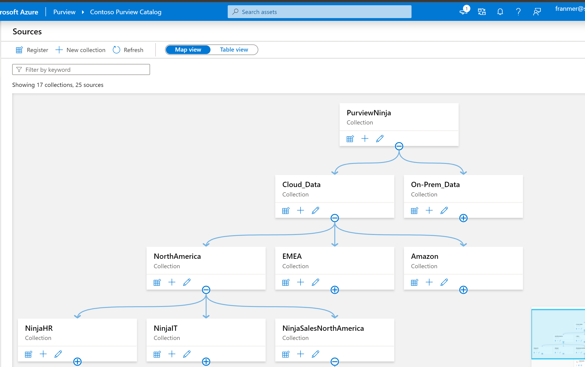

# Create a chargeback report for Azure Purview

I was led to create this report during a client project in order to track the costs of the different scans per collection.

***********************

**WARNING**. The method of scans in Azure Purview will change and become dynamic. As a result, the information in Azure Log Analytics may no longer be reliable by the time the new metrics are obtained. However, this article will still help you if you want to create your own Power BI reports using the Azure Purview API   

**********************


We'll see how to use information from Azure Log Analytics to create a chargeback report.
The following is an illustration of the type of report that you can create:


## Pre requis

- An [Azure Purview account](https://docs.microsoft.com/en-us/azure/purview/create-catalog-portal)
- An [Azure Log Analytics workspace](https://docs.microsoft.com/en-us/azure/azure-monitor/logs/quick-create-workspace)
- [Power BI Desktop](https://www.microsoft.com/en-us/download/details.aspx?id=58494) 
- Optional: a Power BI Pro or Premium license


## Azure Purview
### Azure Purview setup

First, we'll configure Azure Purview to send telemetry to Azure Log Analytics

From the Azure portal, find and select your Azure Purview account
click **"Diagnostic settings"**, then **"+ Add diagnostic setting"**


In the "Diagnostic setting" window, in the "Category details" section, check:
- ScanStatusLogEvent
- AllMetrics

Then in the "Destination details" part check the box **"Send to Log Analytics workspace"** and fill in the information for your Azure Log Analytics workspace.

Click **"Save"**


## Azure Log Analytics
### Create the Azure Log Analytics query

From the Azure portal, find and select your Azure Log Analytics workspace

Click **"Logs"**


We will use the information from the "PurviewScanStatusLogs" table
Copy the query below in order to retrieve the logs for the last 30 days:

```javascript
PurviewScanStatusLogs
| where TimeGenerated > ago(30d)
```

Paste this query into the editor as shown in the screenshot below, and then click **"Run"**  :


### Export to Power BI
Now that we have the desired result, we will export it to Power BI

click **"Export"**, then click **"Export to Power BI (M query)"**


A text file is then generated and downloaded with the M script allowing data recovery from Power BI Desktop.


## Report creation
### Retrieving Azure Log Analytics data

Open the previously downloaded text file and copy the M script (the part framed in red)


From Power BI Desktop, click **"Get data"** then **"Blank Query"**


once in the Power Query Editor, in **"Home"** tab, click **"Advanced Editor"**


Delete the default code and then paste the M script you copied before, and then click  **"Done"** :


You should get a result similar to the one below. You can also rename the query directly from the field **"Name"**


Click **"Close & Apply"** to go back to Power BI desktop and start creating your report


### Get Azure Purview's collection information
#### Create a Service Principal

 The goal here is to retrieve information from Azure Purview for inclusion in our report. We'll retrieve data about the collections defined in Azure Purview:

 

  it is necessary to register an application with Azure Active Directoy and create a service principal. The procedure can be found here:

  https://docs.microsoft.com/en-us/azure/active-directory/develop/howto-create-service-principal-portal#register-an-application-with-azure-ad-and-create-a-service-principal

  Copy the following information:

- Application (client) ID
- Directory (tenant) ID
- Secret


#### Connect to Azure Purview API

From Power BI Desktop, "Home" tab, clic on **"Transform Data"**


Then, in Power Query Editor, clic **"New source"**, **"Blank query"** then **"Advanced Editor"**


Copy and paste the following M Script. Don't forget to add your information:

```javascript
let
    
    url = "https://login.microsoftonline.com/<YOUR TENANT ID>/oauth2/token",
    myGrant_type = "client_credentials",
    myResource = "73c2949e-da2d-457a-9607-fcc665198967",  //It could also be "https://purview.azure.net" 
    myClient_id = "<YOUR CLIENT ID>",
    myClient_secret = "<YOUR CLIENT SECRET>",

    body  = "grant_type=" & myGrant_type & "&resource=" & myResource & "&client_id=" & myClient_id & "&client_secret=" & myClient_secret,
    tokenResponse = Json.Document(Web.Contents(url,[Headers = [#"Content-Type"="application/x-www-form-urlencoded"], Content =  Text.ToBinary(body) ] )),   
    
        
    
    data_url = "https://<YOUR AZURE PURVIEW ACCOUNT NAME>.scan.purview.azure.com/datasources?api-version=2018-12-01-preview",
    AccessTokenHeader = "Bearer " & tokenResponse[access_token],

    Source = Json.Document(Web.Contents(data_url, [Headers=[Authorization= AccessTokenHeader,#"Content-Type"="application/json"]])),
    value = Source[value],
    #"Converted to Table" = Table.FromList(value, Splitter.SplitByNothing(), null, null, ExtraValues.Error),
    #"Expanded Column1" = Table.ExpandRecordColumn(#"Converted to Table", "Column1", {"properties", "kind", "id", "name"}, {"properties", "kind", "id", "name"}),
    #"Expanded properties" = Table.ExpandRecordColumn(#"Expanded Column1", "properties", {"createdAt", "lastModifiedAt", "parentCollection", "collection", "serviceUrl", "roleARN", "awsAccountId", "endpoint", "resourceGroup", "subscriptionId", "location", "resourceName", "tenant", "serverEndpoint", "dedicatedSqlEndpoint", "serverlessSqlEndpoint", "host", "applicationServer", "systemNumber", "clusterUrl", "port", "service"}, {"createdAt", "lastModifiedAt", "parentCollection", "collection", "serviceUrl", "roleARN", "awsAccountId", "endpoint", "resourceGroup", "subscriptionId", "location", "resourceName", "tenant", "serverEndpoint", "dedicatedSqlEndpoint", "serverlessSqlEndpoint", "host", "applicationServer", "systemNumber", "clusterUrl", "port", "service"}),
    #"Expanded parentCollection" = Table.ExpandRecordColumn(#"Expanded properties", "parentCollection", {"type", "referenceName"}, {"parentCollection.type", "parentCollection.referenceName"}),
    #"Removed Other Columns" = Table.SelectColumns(#"Expanded parentCollection",{"parentCollection.referenceName", "kind", "id", "name"})
in
    #"Removed Other Columns"

```

You should get something like:


Click the **"Done"** button. You will achieve a result similar to the one below. On the right, click in the **"Name"** field to change the name of your query.


