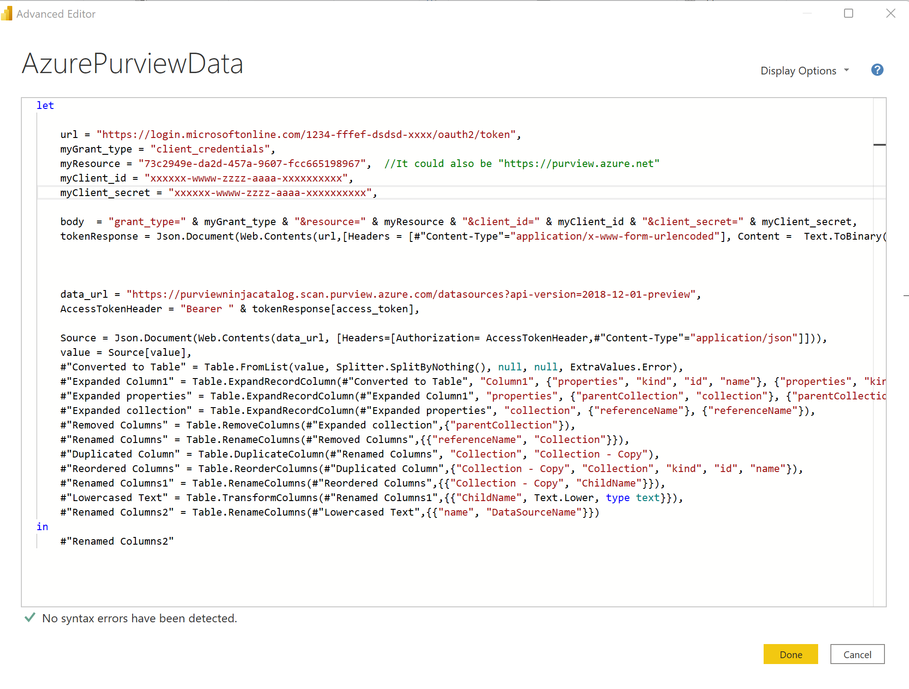
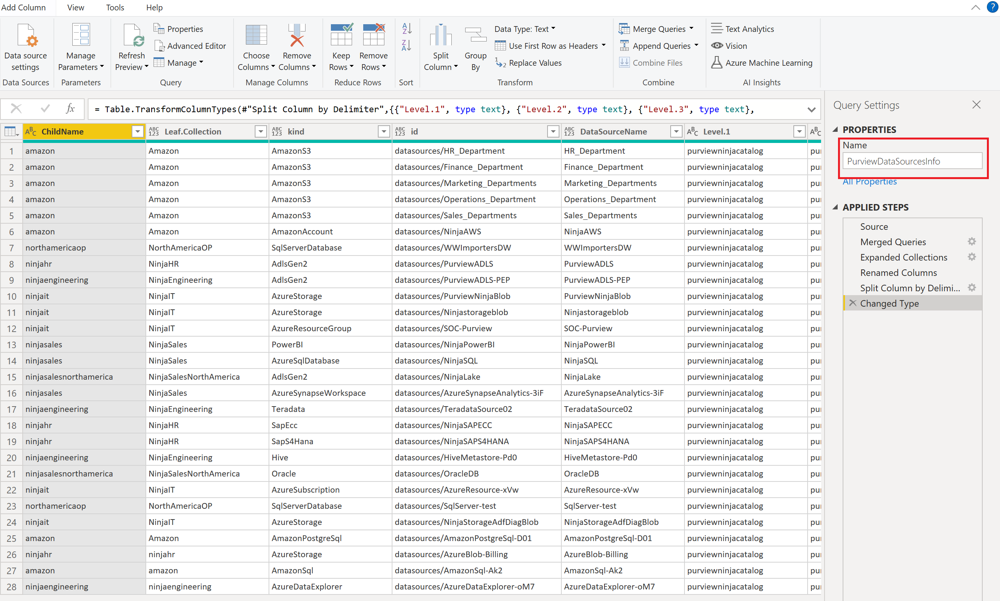

# Create a chargeback report for Azure Purview

I was led to create this report during a client project in order to track the costs of the different scans per collection. A sample of this report is available here

***********************

**WARNING**. The method of scans in Azure Purview will change and become dynamic. As a result, the information in Azure Log Analytics may no longer be reliable by the time the new metrics are obtained. However, this article will still help you if you want to create your own Power BI reports using the Azure Purview API   

**********************


We'll see how to use information from Azure Log Analytics to create a chargeback report.
The following is an illustration of the type of report that you can create:


## Pre requis

- An [Azure Purview account](https://docs.microsoft.com/en-us/azure/purview/create-catalog-portal)
- An [Azure Log Analytics workspace](https://docs.microsoft.com/en-us/azure/azure-monitor/logs/quick-create-workspace)
- [Power BI Desktop](https://www.microsoft.com/en-us/download/details.aspx?id=58494) 
- Optional: a Power BI Pro or Premium license


## Azure Purview
### Azure Purview setup

First, we'll configure Azure Purview to send telemetry to Azure Log Analytics

From the Azure portal, find and select your Azure Purview account
click **"Diagnostic settings"**, then **"+ Add diagnostic setting"**


In the "Diagnostic setting" window, in the "Category details" section, check:
- ScanStatusLogEvent
- AllMetrics

Then in the "Destination details" part check the box **"Send to Log Analytics workspace"** and fill in the information for your Azure Log Analytics workspace.

Click **"Save"**


## Azure Log Analytics
### Create the Azure Log Analytics query

From the Azure portal, find and select your Azure Log Analytics workspace

Click **"Logs"**


We will use the information from the "PurviewScanStatusLogs" table
Copy the query below in order to retrieve the logs for the last 30 days:

```javascript
PurviewScanStatusLogs
| where TimeGenerated > ago(30d)
```

Paste this query into the editor as shown in the screenshot below, and then click **"Run"**  :


### Export to Power BI
Now that we have the desired result, we will export it to Power BI

click **"Export"**, then click **"Export to Power BI (M query)"**


A text file is then generated and downloaded with the M script allowing data recovery from Power BI Desktop.


## Report creation
### Retrieving Azure Log Analytics data

Open the previously downloaded text file and copy the M script (the part framed in red)


From Power BI Desktop, click **"Get data"** then **"Blank Query"**


once in the Power Query Editor, in **"Home"** tab, click **"Advanced Editor"**


Delete the default code and then paste the M script you copied before, and then click  **"Done"** :


You should get a result similar to the one below. You can also rename the query directly from the field **"Name"**


Click **"Close & Apply"** to go back to Power BI desktop and start creating your report


### Get Azure Purview's collection information
#### Create a Service Principal

 The goal here is to retrieve information from Azure Purview for inclusion in our report. We'll retrieve data about the collections defined in Azure Purview:

 

  it is necessary to register an application with Azure Active Directoy and create a service principal. The procedure can be found here:

  https://docs.microsoft.com/en-us/azure/active-directory/develop/howto-create-service-principal-portal#register-an-application-with-azure-ad-and-create-a-service-principal

  Copy the following information:

- Application (client) ID
- Directory (tenant) ID
- Secret


#### Connect to Azure Purview API

From Power BI Desktop, "Home" tab, clic on **"Transform Data"**


Then, in Power Query Editor, clic **"New source"**, **"Blank query"** then **"Advanced Editor"**


Copy and paste the following M Script. Don't forget to add your information:

```javascript
let
    
    url = "https://login.microsoftonline.com/<YOUR TENANT ID>/oauth2/token",
    myGrant_type = "client_credentials",
    myResource = "73c2949e-da2d-457a-9607-fcc665198967",  //It could also be "https://purview.azure.net" 
    myClient_id = "<YOUR CLIENT ID>",
    myClient_secret = "<YOUR CLIENT SECRET>",

    body  = "grant_type=" & myGrant_type & "&resource=" & myResource & "&client_id=" & myClient_id & "&client_secret=" & myClient_secret,
    tokenResponse = Json.Document(Web.Contents(url,[Headers = [#"Content-Type"="application/x-www-form-urlencoded"], Content =  Text.ToBinary(body) ] )),   
    
        
    
    data_url = "https://<YOUR AZURE PURVIEW ACCOUNT NAME>.scan.purview.azure.com/datasources?api-version=2018-12-01-preview",
    AccessTokenHeader = "Bearer " & tokenResponse[access_token],

    Source = Json.Document(Web.Contents(data_url, [Headers=[Authorization= AccessTokenHeader,#"Content-Type"="application/json"]])),
    value = Source[value],
    #"Converted to Table" = Table.FromList(value, Splitter.SplitByNothing(), null, null, ExtraValues.Error),
    #"Expanded Column1" = Table.ExpandRecordColumn(#"Converted to Table", "Column1", {"properties", "kind", "id", "name"}, {"properties", "kind", "id", "name"}),
    #"Expanded properties" = Table.ExpandRecordColumn(#"Expanded Column1", "properties", {"createdAt", "lastModifiedAt", "parentCollection", "collection", "serviceUrl", "roleARN", "awsAccountId", "endpoint", "resourceGroup", "subscriptionId", "location", "resourceName", "tenant", "serverEndpoint", "dedicatedSqlEndpoint", "serverlessSqlEndpoint", "host", "applicationServer", "systemNumber", "clusterUrl", "port", "service"}, {"createdAt", "lastModifiedAt", "parentCollection", "collection", "serviceUrl", "roleARN", "awsAccountId", "endpoint", "resourceGroup", "subscriptionId", "location", "resourceName", "tenant", "serverEndpoint", "dedicatedSqlEndpoint", "serverlessSqlEndpoint", "host", "applicationServer", "systemNumber", "clusterUrl", "port", "service"}),
    #"Expanded parentCollection" = Table.ExpandRecordColumn(#"Expanded properties", "parentCollection", {"type", "referenceName"}, {"parentCollection.type", "parentCollection.referenceName"}),
    #"Removed Other Columns" = Table.SelectColumns(#"Expanded parentCollection",{"parentCollection.referenceName", "kind", "id", "name"})
in
    #"Removed Other Columns"

```

You should get something like:



Click the **"Done"** button. You will achieve a result similar to the one below. On the right, click in the **"Name"** field to change the name of your query.


Now that you have the initial query that retrieves the data, we will reference it, so that we can use it as a basis for rebuilding the hierarchy of our organization.

Right-click the previously created Azure Purview query, and then select **"reference"**


Once the reference is made, select the new query and click on **"Advanced Editor"**. You should get something similar to the screenshot below


 Copy the M script below to rebuild the flowchart hierarchy present in Azure Purview

```Javascript
let
    Source = AzurePurviewData,
    #"Filtered Rows" = Table.SelectRows(Source, each ([kind] = "Collection")),
    #"Renamed Columns" = Table.RenameColumns(#"Filtered Rows",{{"parentCollection.referenceName", "ParentName"}, {"name", "ChildName"}}),

    ListChild = List.Buffer(#"Renamed Columns"[ChildName]),
    ListParent = List.Buffer(#"Renamed Columns"[ParentName]),


    fnCreateHiearchy = (n as text) as text =>
        let 
            ParentPosition = List.PositionOf (ListChild, n),
            ParentName = ListParent{ParentPosition},
            ChildName = ListChild{ParentPosition}     
        in 
            if ParentName = null then ListChild{ParentPosition} else @fnCreateHiearchy(ParentName) & "|" & ChildName,

    FinaleTable = Table.AddColumn(#"Renamed Columns", "Collections", each fnCreateHiearchy([ChildName]), type text)
in
    FinaleTable

```

You should get something like this:



Click the **"Done"** button. You should get the following result. Note the new column **"Collections"** which will represent the Parent-Child relationships of your organization chart.

Consider renaming your query.


Now that you have the basic material, you can continue to develop your report as you see fit. For example, use the feature **"Split Column by delimiter"** to create one column per child of your flowchart, to then use them with the visual **"Decomposition tree"**. 

#### Privacy Level

If the report is to be deployed to Power BI Service, it's important to set the right level of privacy for your data sources.
The first time you sign in to Azure Log Analytics, the window below appears. Choose **"Organizational account"** and click **"Sign In"**


Therefore the connection was made using an **"Organizational"** level for this data source. To avoid problems after the report is published to Power BI Service, it's important that all other data sources in the report are at the same level of privacy.

For **ALL** other data sources, do the following steps

Click on **"Transform data"** then on **"Data source settings"**


In the **"Data Source Setting"** window, select a data source and then click **"Edit Permissions"**


In the **"Privacy Level"** field, select the **"organizational"** level, then click the **"Ok"** button to validate


Repeat for other data sources


## What I learned with the creation of this report
### Updating the Model Schema

I tried to dynamically create the creation of the number of columns based on the number of levels in my flowchart.

So in Power BI Desktop, I used the following M script:

```Javascript
    DynamicColumList = List.Transform({
        1..List.Max(Table.AddColumn(#"Renamed Columns1","NbDelimiter",each List.Count(Text.PositionOfAny([CollectionLevel],{"|"},Occurrence.All)
        ))[NbDelimiter]
        )+1

    },each "CollectionLevel." & Text.From(_)),  
    
    
    #"Split Column by Delimiter" = Table.SplitColumn(#"Renamed Columns1", "CollectionLevel", Splitter.SplitTextByDelimiter("|", QuoteStyle.Csv),DynamicColumList)

```

This works great in Power BI Desktop, and my model adds or removes columns based on the number of levels in my flowchart. But not in Power BI service. When updating the report

Power BI Desktop recreates the model schema while Power BI service simply reloads the information during the update, without touching the schema. It is therefore necessary to anticipate the number of levels of the one wishes to display in the report 

### Privacy Level

When the report was first created, I wanted to separate the various requests by 'role', so to speak. For example, a first request to retrieve the Bearer Token, another to connect to Azure Purview, and then another to create the hierarchies.

However, even though it worked very well with Power BI Desktop, once I was published in Power BI Service, I got the following error after the update:


*"Processing error: [Unable to combine data] Section1/AzurePurviewData/Removed Other Columns references other queries or steps, so it may not directly access a data source. Please rebuild this data combination."*

So I had to merge my first 2 requests (get the token and then sign in to Azure Purview) and then set the privacy levels.

